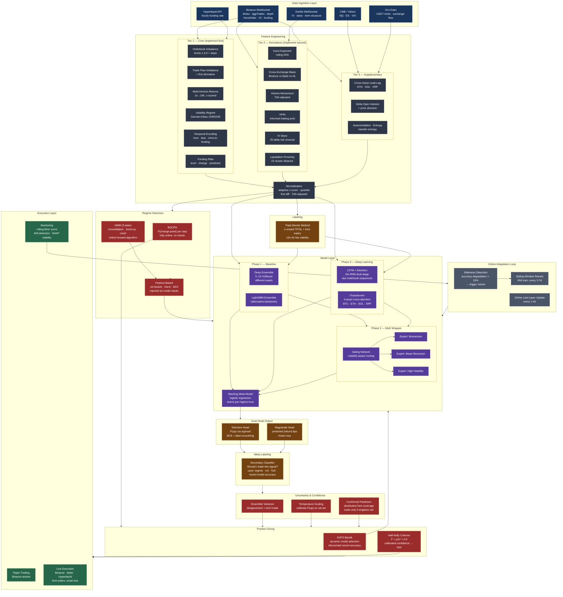
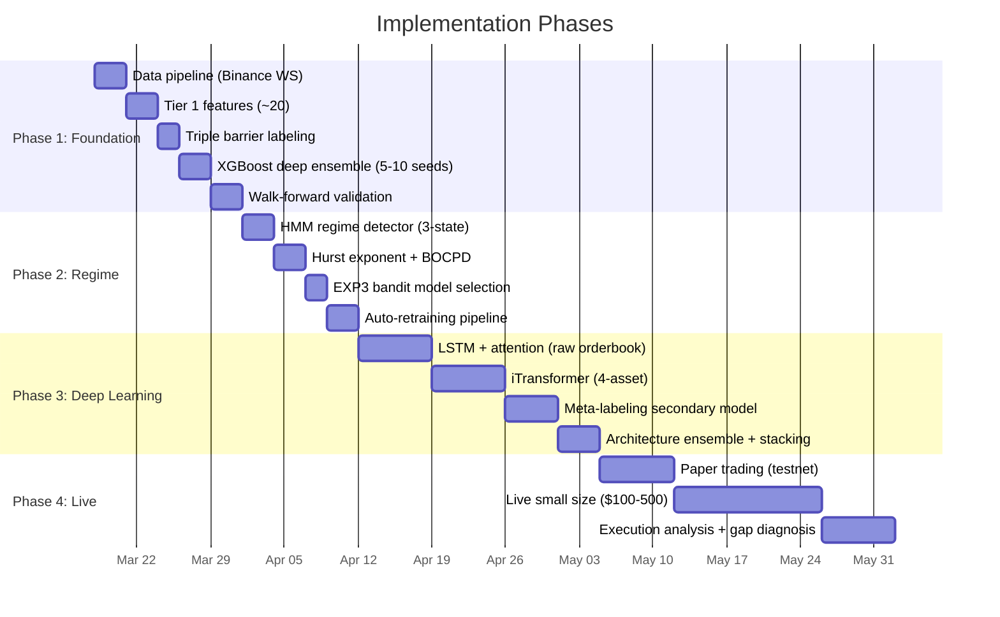
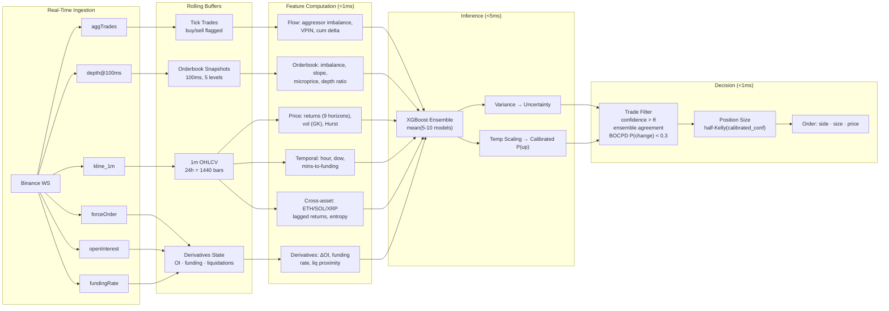
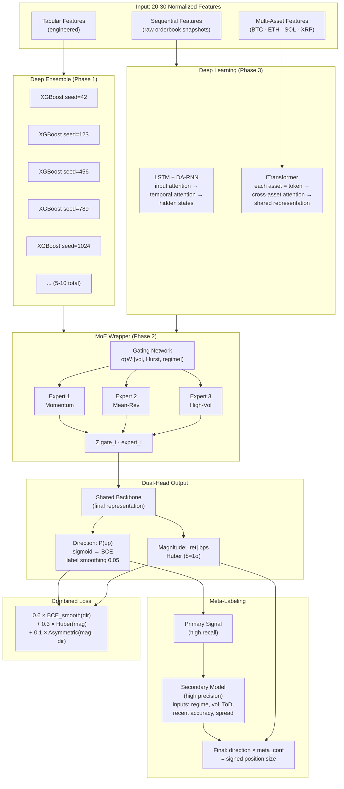

# Directional Classifier — Architecture Diagram

## System Overview

```mermaid
graph TB
    subgraph DATA["Data Ingestion Layer"]
        direction LR
        BN_WS["Binance WebSocket<br/>klines · aggTrades · depth<br/>forceOrder · OI · funding"]
        DR_WS["Deribit WebSocket<br/>IV · skew · term structure"]
        HL_WS["Hyperliquid API<br/>hourly funding rate"]
        CME["CME / Yahoo<br/>NQ · ES · VIX"]
        CHAIN["On-Chain<br/>USDT mints · exchange flow"]
    end

    subgraph FEAT["Feature Engineering"]
        direction TB

        subgraph T1["Tier 1 — Core (implement first)"]
            OBI["Orderbook Imbalance<br/>levels 1,3,5 + slope"]
            TFI["Trade Flow Imbalance<br/>+ first derivative"]
            RET["Multi-Horizon Returns<br/>1s→24h, z-scored"]
            VOL["Volatility Regime<br/>Garman-Klass 15/60/240"]
            TEMP["Temporal Encoding<br/>hour · dow · mins-to-funding"]
            FUND["Funding Rate<br/>level · change · predicted"]
        end

        subgraph T2["Tier 2 — Derivatives (implement second)"]
            HURST["Hurst Exponent<br/>rolling DFA"]
            BASIS["Cross-Exchange Basis<br/>Binance vs Bybit vs HL"]
            VMOM["Volume Momentum<br/>ToD-adjusted"]
            VPIN["VPIN<br/>informed trading prob"]
            IVSKEW["IV Skew<br/>25-delta risk reversal"]
            LIQ["Liquidation Proximity<br/>OI cluster distance"]
        end

        subgraph T3["Tier 3 — Supplementary"]
            XLEAD["Cross-Asset Lead-Lag<br/>ETH · SOL · XRP"]
            DOI["Delta Open Interest<br/>+ price direction"]
            ACF["Autocorrelation · Entropy<br/>transfer entropy"]
        end

        NORM["Normalization<br/>adaptive z-score · quantile<br/>first-diff · ToD-adjusted"]
    end

    subgraph LABEL["Labeling"]
        TB_LABEL["Triple Barrier Method<br/>σ-scaled TP/SL + time expiry<br/>≥2σ for fee viability"]
    end

    subgraph REGIME["Regime Detection"]
        HMM["HMM (3-state)<br/>consolidation · trend-up · crash<br/>online forward algorithm"]
        BOCPD["BOCPD<br/>P(change-point) per step<br/>fully online, no retrain"]
        FEAT_REG["Feature-Based<br/>vol bucket · Hurst · ADX<br/>injected as model inputs"]
    end

    subgraph MODELS["Model Layer"]
        direction TB

        subgraph PH1["Phase 1 — Baseline"]
            XGB["Deep Ensemble<br/>5–10 XGBoost<br/>different seeds"]
            LGB["LightGBM Ensemble<br/>(alternative backbone)"]
        end

        subgraph PH3["Phase 3 — Deep Learning"]
            LSTM["LSTM + Attention<br/>DA-RNN dual-stage<br/>raw orderbook sequences"]
            ITRANS["iTransformer<br/>4-asset cross-attention<br/>BTC · ETH · SOL · XRP"]
        end

        subgraph MOE_W["Phase 2 — MoE Wrapper"]
            MOE_GATE["Gating Network<br/>volatility-aware routing"]
            EXP_MOM["Expert: Momentum"]
            EXP_MR["Expert: Mean-Reversion"]
            EXP_VOL["Expert: High-Volatility"]
        end

        STACK["Stacking Meta-Model<br/>logistic regression<br/>learns per-regime trust"]
    end

    subgraph OUTPUT["Dual-Head Output"]
        DIR_HEAD["Direction Head<br/>P(up) via sigmoid<br/>BCE + label smoothing"]
        MAG_HEAD["Magnitude Head<br/>predicted |return| bps<br/>Huber loss"]
    end

    subgraph META["Meta-Labeling"]
        META_MODEL["Secondary Classifier<br/>'Should I trade this signal?'<br/>uses: regime · vol · ToD ·<br/>recent model accuracy"]
    end

    subgraph UNCERT["Uncertainty & Confidence"]
        ENS_VAR["Ensemble Variance<br/>disagreement = don't trade"]
        TSCALE["Temperature Scaling<br/>calibrate P(up) on val set"]
        CONFORMAL["Conformal Prediction<br/>distribution-free coverage<br/>trade only if singleton set"]
    end

    subgraph SIZING["Position Sizing"]
        KELLY["Half-Kelly Criterion<br/>f* = μ/σ² × 0.5<br/>calibrated confidence → size"]
        BANDIT["EXP3 Bandit<br/>dynamic model selection<br/>discounted recent accuracy"]
    end

    subgraph EXEC["Execution Layer"]
        PAPER["Paper Trading<br/>Binance testnet"]
        LIVE["Live Execution<br/>Binance · Bybit · Hyperliquid<br/>limit orders, small size"]
        MONITOR["Monitoring<br/>rolling Brier score<br/>drift detection · SHAP stability"]
    end

    subgraph RETRAIN["Online Adaptation Loop"]
        SLIDE["Sliding Window Retrain<br/>90d train, every 3-7d"]
        ONLINE["Online Last-Layer Update<br/>every 1-4h"]
        STALE["Staleness Detection<br/>accuracy degradation > 10%<br/>→ trigger retrain"]
    end

    %% Data flow
    BN_WS --> T1
    BN_WS --> T2
    BN_WS --> T3
    DR_WS --> T2
    HL_WS --> T1
    CME --> T3
    CHAIN --> T3

    T1 --> NORM
    T2 --> NORM
    T3 --> NORM

    NORM --> LABEL
    NORM --> REGIME

    REGIME --> FEAT_REG
    FEAT_REG --> MODELS
    HMM --> FEAT_REG
    BOCPD --> SIZING

    NORM --> PH1
    NORM --> PH3
    LABEL --> PH1
    LABEL --> PH3

    PH1 --> MOE_W
    PH3 --> MOE_W
    MOE_GATE --> EXP_MOM
    MOE_GATE --> EXP_MR
    MOE_GATE --> EXP_VOL

    PH1 --> STACK
    PH3 --> STACK
    MOE_W --> STACK

    STACK --> OUTPUT
    DIR_HEAD --> META
    MAG_HEAD --> META

    META --> UNCERT
    ENS_VAR --> SIZING
    TSCALE --> SIZING
    CONFORMAL --> SIZING

    SIZING --> EXEC
    KELLY --> EXEC
    BANDIT --> MODELS

    MONITOR --> RETRAIN
    STALE --> SLIDE
    RETRAIN --> MODELS

    %% Styling
    classDef data fill:#1a365d,stroke:#2b6cb0,color:#fff
    classDef feat fill:#2d3748,stroke:#4a5568,color:#fff
    classDef model fill:#553c9a,stroke:#6b46c1,color:#fff
    classDef output fill:#744210,stroke:#975a16,color:#fff
    classDef risk fill:#9b2c2c,stroke:#c53030,color:#fff
    classDef exec fill:#276749,stroke:#38a169,color:#fff
    classDef retrain fill:#4a5568,stroke:#718096,color:#fff

    class BN_WS,DR_WS,HL_WS,CME,CHAIN data
    class OBI,TFI,RET,VOL,TEMP,FUND,HURST,BASIS,VMOM,VPIN,IVSKEW,LIQ,XLEAD,DOI,ACF,NORM feat
    class XGB,LGB,LSTM,ITRANS,MOE_GATE,EXP_MOM,EXP_MR,EXP_VOL,STACK model
    class DIR_HEAD,MAG_HEAD,META_MODEL,TB_LABEL output
    class HMM,BOCPD,FEAT_REG,ENS_VAR,TSCALE,CONFORMAL,KELLY,BANDIT risk
    class PAPER,LIVE,MONITOR exec
    class SLIDE,ONLINE,STALE retrain
```

## Phased Implementation Timeline

```mermaid
gantt
    title Implementation Phases
    dateFormat YYYY-MM-DD
    axisFormat %b %d

    section Phase 1: Foundation
    Data pipeline (Binance WS)           :p1a, 2026-03-18, 3d
    Tier 1 features (~20)                :p1b, after p1a, 3d
    Triple barrier labeling              :p1c, after p1b, 2d
    XGBoost deep ensemble (5-10 seeds)   :p1d, after p1c, 3d
    Walk-forward validation              :p1e, after p1d, 3d

    section Phase 2: Regime
    HMM regime detector (3-state)        :p2a, after p1e, 3d
    Hurst exponent + BOCPD               :p2b, after p2a, 3d
    EXP3 bandit model selection          :p2c, after p2b, 2d
    Auto-retraining pipeline             :p2d, after p2c, 3d

    section Phase 3: Deep Learning
    LSTM + attention (raw orderbook)     :p3a, after p2d, 7d
    iTransformer (4-asset)               :p3b, after p3a, 7d
    Meta-labeling secondary model        :p3c, after p3b, 5d
    Architecture ensemble + stacking     :p3d, after p3c, 4d

    section Phase 4: Live
    Paper trading (testnet)              :p4a, after p3d, 7d
    Live small size ($100-500)           :p4b, after p4a, 14d
    Execution analysis + gap diagnosis   :p4c, after p4b, 7d
```

## Data Flow Detail

```mermaid
flowchart LR
    subgraph INGEST["Real-Time Ingestion"]
        WS["Binance WS"]
        AGG["aggTrades"]
        DEPTH["depth@100ms"]
        KLINE["kline_1m"]
        FORCE["forceOrder"]
        OI_S["openInterest"]
        FUND_S["fundingRate"]
    end

    subgraph BUFFER["Rolling Buffers"]
        OHLCV["1m OHLCV<br/>24h = 1440 bars"]
        BOOK["Orderbook Snapshots<br/>100ms, 5 levels"]
        TRADES["Tick Trades<br/>buy/sell flagged"]
        DERIV["Derivatives State<br/>OI · funding · liquidations"]
    end

    subgraph FEATURES["Feature Computation (<1ms)"]
        F1["Orderbook: imbalance, slope,<br/>microprice, depth ratio"]
        F2["Flow: aggressor imbalance,<br/>VPIN, cum delta"]
        F3["Price: returns (9 horizons),<br/>vol (GK), Hurst"]
        F4["Derivatives: ΔOI, funding<br/>rate, liq proximity"]
        F5["Temporal: hour, dow,<br/>mins-to-funding"]
        F6["Cross-asset: ETH/SOL/XRP<br/>lagged returns, entropy"]
    end

    subgraph PREDICT["Inference (<5ms)"]
        ENS["XGBoost Ensemble<br/>mean(5-10 models)"]
        VAR["Variance → Uncertainty"]
        CAL["Temp Scaling → Calibrated P(up)"]
    end

    subgraph DECIDE["Decision (<1ms)"]
        FILT["Trade Filter<br/>confidence > θ<br/>ensemble agreement<br/>BOCPD P(change) < 0.3"]
        SIZE["Position Size<br/>half-Kelly(calibrated_conf)"]
        ORD["Order: side · size · price"]
    end

    WS --> AGG & DEPTH & KLINE & FORCE & OI_S & FUND_S
    AGG --> TRADES
    DEPTH --> BOOK
    KLINE --> OHLCV
    FORCE & OI_S & FUND_S --> DERIV

    BOOK --> F1
    TRADES --> F2
    OHLCV --> F3
    DERIV --> F4
    OHLCV --> F5
    OHLCV --> F6

    F1 & F2 & F3 & F4 & F5 & F6 --> ENS
    ENS --> VAR --> FILT
    ENS --> CAL --> FILT
    FILT --> SIZE --> ORD
```

## Model Architecture Detail

```mermaid
flowchart TB
    subgraph INPUT["Input: 20-30 Normalized Features"]
        TAB["Tabular Features<br/>(engineered)"]
        SEQ["Sequential Features<br/>(raw orderbook snapshots)"]
        MULTI["Multi-Asset Features<br/>(BTC · ETH · SOL · XRP)"]
    end

    subgraph ENSEMBLE["Deep Ensemble (Phase 1)"]
        XGB1["XGBoost seed=42"]
        XGB2["XGBoost seed=123"]
        XGB3["XGBoost seed=456"]
        XGB4["XGBoost seed=789"]
        XGB5["XGBoost seed=1024"]
        XGB_N["... (5-10 total)"]
    end

    subgraph DL["Deep Learning (Phase 3)"]
        LSTM_M["LSTM + DA-RNN<br/>input attention →<br/>temporal attention →<br/>hidden states"]
        ITRANS_M["iTransformer<br/>each asset = token →<br/>cross-asset attention →<br/>shared representation"]
    end

    subgraph MOE["MoE Wrapper (Phase 2)"]
        GATE["Gating Network<br/>σ(W·[vol, Hurst, regime])"]
        E1["Expert 1<br/>Momentum"]
        E2["Expert 2<br/>Mean-Rev"]
        E3["Expert 3<br/>High-Vol"]
        MIX["Σ gate_i · expert_i"]
    end

    subgraph HEADS["Dual-Head Output"]
        SHARED["Shared Backbone<br/>(final representation)"]
        DH["Direction: P(up)<br/>sigmoid → BCE<br/>label smoothing 0.05"]
        MH["Magnitude: |ret| bps<br/>Huber (δ=1σ)"]
    end

    subgraph METALABEL["Meta-Labeling"]
        PRIMARY["Primary Signal<br/>(high recall)"]
        SECONDARY["Secondary Model<br/>(high precision)<br/>inputs: regime, vol, ToD,<br/>recent accuracy, spread"]
        FINAL["Final: direction × meta_conf<br/>= signed position size"]
    end

    TAB --> ENSEMBLE
    SEQ --> DL
    MULTI --> ITRANS_M

    ENSEMBLE --> MOE
    DL --> MOE
    GATE --> E1 & E2 & E3
    E1 & E2 & E3 --> MIX

    MIX --> SHARED
    SHARED --> DH & MH

    DH --> PRIMARY --> SECONDARY --> FINAL
    MH --> FINAL

    subgraph LOSS["Combined Loss"]
        L["0.6 × BCE_smooth(dir)<br/>+ 0.3 × Huber(mag)<br/>+ 0.1 × Asymmetric(mag, dir)"]
    end
    DH & MH --> L
```
